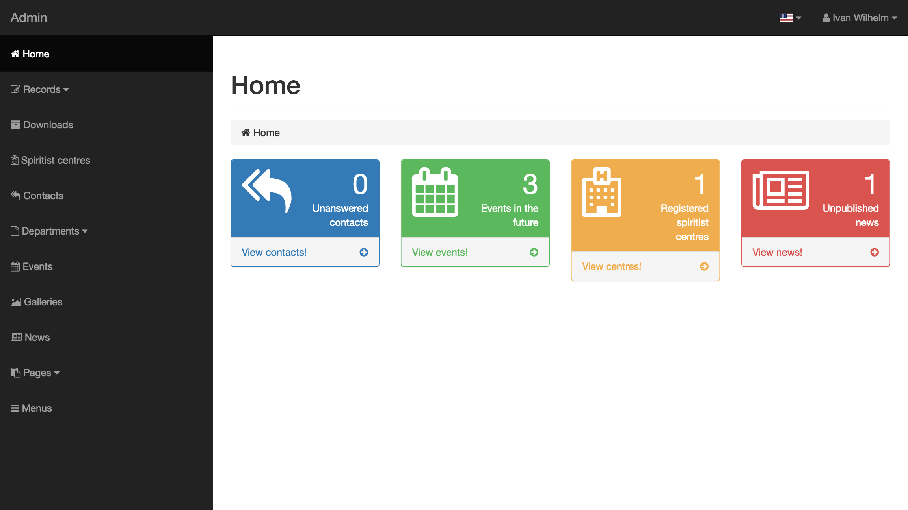
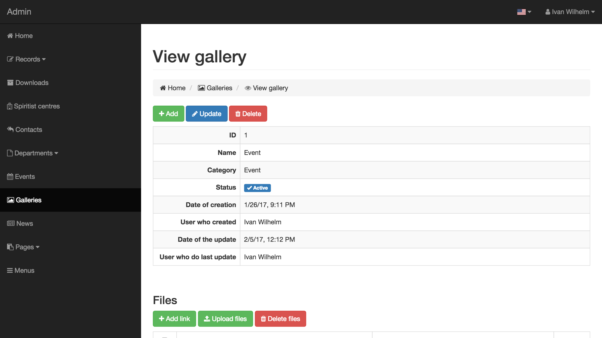
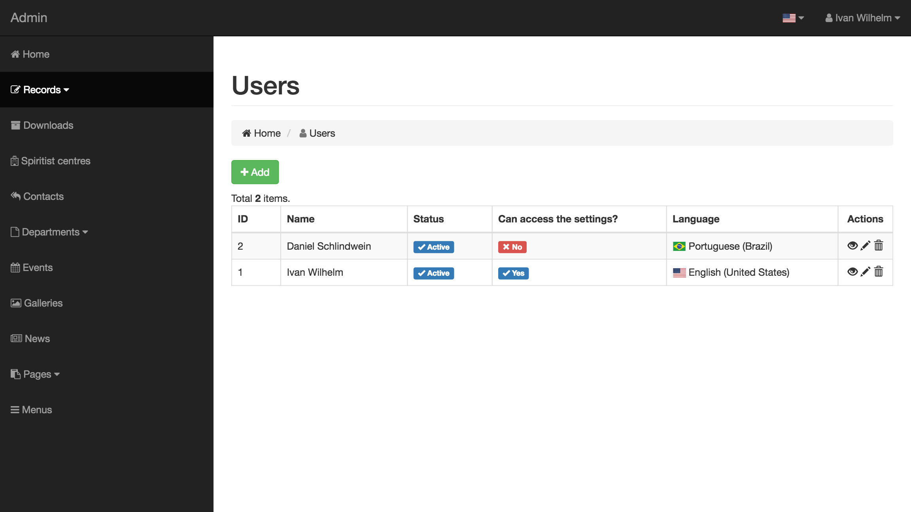

Admin Portal to Spiritist Council
=============================================================================

[Clique aqui](README.en-US.md) para acessar a versão em Português (Brasil).

The frontend page can be find [here](https://github.com/ivanwhm/uresc-frontend).

This tool is part of a portal to spiritist councils of Santa Catarina Brazilian State, to allow the propagation of Spiritist Doctrine.

Currently this tool have the following resources:

 - **Personalized pages**: allow users to create their own personalized pages and publish texts, links, images, videos, etc.
 - **Spiritists Centres**: allow users to record spiritists centres who belongs of their spiritist council.
 - **Galleries**: allow users to create their own galleries to publish photos, videos and links.
 - **Events**: allow users to record on one or more calendars to spread activities. These calendars allows the link with a spiritist centre to spread their own events.
 - **News**: allow users to record, update and publish news.
 - **Departments**: allows the user to create personalized pages to departments of spiritists councils and publish texts, links, images, videos, etc.
 - **Users**: complete user records.
 - **Languages supports**: support to many langues. Currently available on Portuguese (Brazil) and English (United States).
 - **Settings**: allow personalize all the aspects of the portal, like temes, Messages and menu orders.
 
Currently this portal was created to [4ª União Regional Espírita de Santa Catarina](http://www.ure4-fec.org.br), however, the source code is totally delivered to download and adaptation. If you want use this tool on your own spiritist council, we are here to help you.

This tool was developed with this following resources:

 - [PHP 5](http://www.php.net)
 - [MySQL 5](http://www.mysql.com)
 - [Yii Framework 2](http://www.yiiframework.net)
 - [Bootstrap 3](http://getbootstrap.com)
 - [Font-awesome 4.7](http://fontawesome.io)
 - [Krajee Components for Yii2](http://demos.krajee.com)
 - [Flag Icon CSS](http://flag-icon-css.lip.is)

Made with &hearts; by Ivan Wilhelm (developer), Daniel Schlindwein (designer), Sílvio Roberto Schimidt (4º URE president), Gabriel Morais Castellain (4ª URE marketing) and Artur Uliano (4ª URE marketing).

Coded with [PhpStorm](https://www.jetbrains.com/phpstorm/) by [JetBrains](https://www.jetbrains.com/)

Screens of the tools:
--------------------

Follows some screens of the tool.

**Login page**

**Main page**

**Menu configuration**

**Pages**

**Galleries**

**Files**

**Events**

**Users and passwords**

