Portal Administrativo União Regional Espírita
=============================================================================

Esta ferramenta é parte de um portal voltado as uniões regionais espíritas do estado de Santa Catarina, para permitir a divulgação do doutrina espírita.

Atualmente a ferramenta de administração do portal conta com os seguintes recursos:

 - **Páginas personalizadas**: permite que os usuários criem páginas personalizadas e possam por meio delas divulgar textos, links, imagens, vídeos, etc.
 - **Centros espíritas**: permite que os usuários podem cadastrar os centros espíritas que fazem parte da reunião a qual a união regional está inserida.
 - **Galerias**: permite que a união regional possa criar galerias para divulgação de fotos, vídeos e links.
 - **Eventos**: possibilita que seja criado um ou mais calendários de eventos para divulgação de atividades. Estes calendários permitem que sejam vinculados aos centros espíritas e desta forma podem ser divulgados eventos específicos.
 - **Notícias**: possibilita o cadastro, alteração e publicação de notícias.
 - Departamentos: permite que os usuários criem páginas personalizadas, porém voltadas aos departamentos da união regional e possam por meio delas divulgar textos, links, imagens, vídeos, etc.
 - **Usuários**: Cadastro completo de usuários.
 - **Múltiplo idiomas**: suporte a múltiplos idiomas. Atualmente disponível em Português do Brasil e Inglês dos Estados Unidos da América.
 - **Configurações**: permite configurar quase todos os aspectos do portal, como tema utilizado, mensagens informativas, ordenação de menu e recursos que serão utilizados no portal.
 
Atualmente a página foi ciada para a 4ª União Regional Espírita de Santa Catarina, porém, o código-fonte está totalmente liberado para download e adaptação. Caso você deseje utilizar esta ferramenta em sua união regional, estamos à disposição para auxiliar em todos os aspectos.

Telas da ferramenta:
--------------------

Página de login

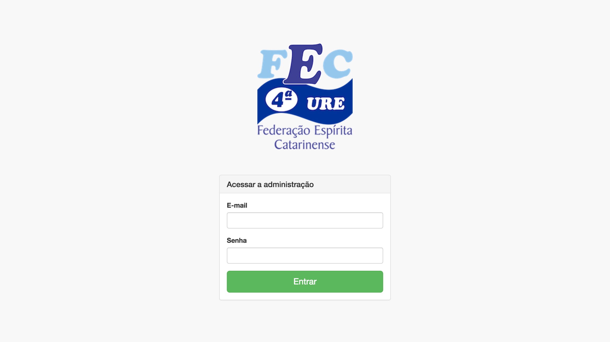

Página principal

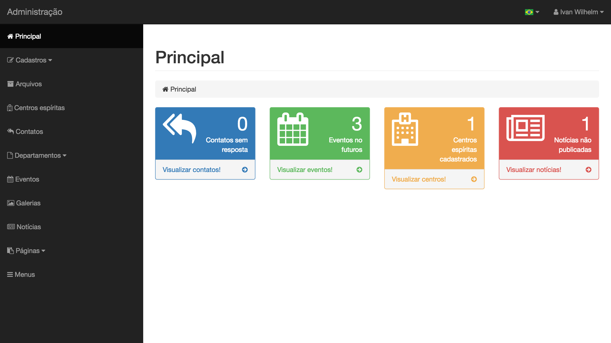

Configuração do menu

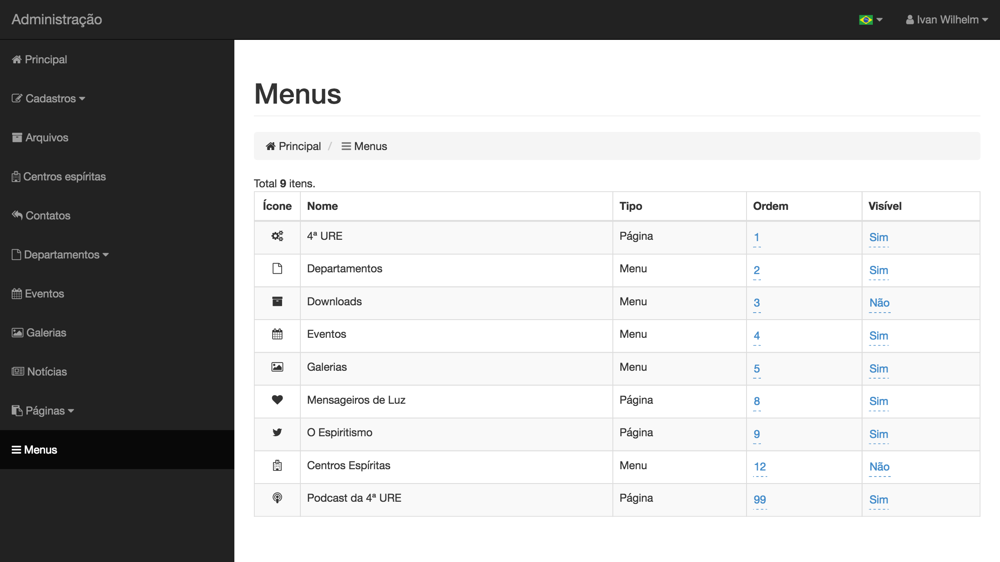

Páginas

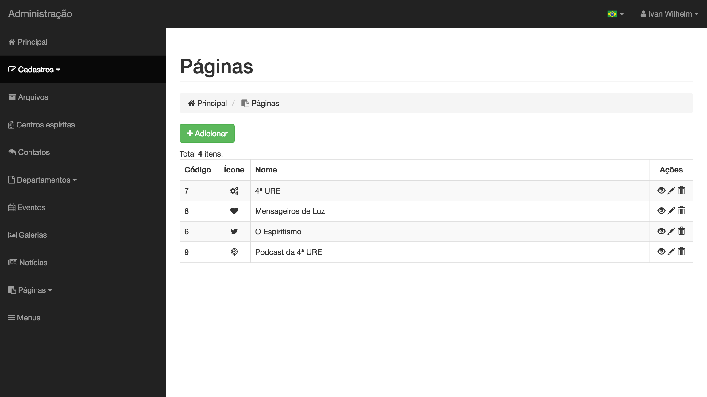

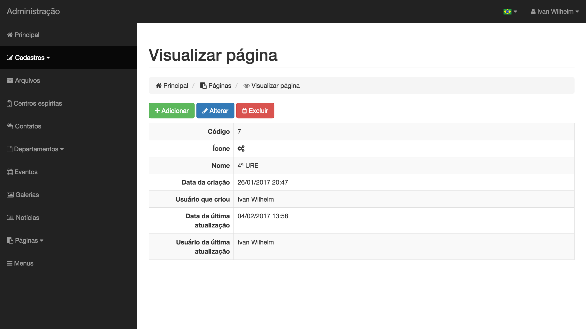

Galerias

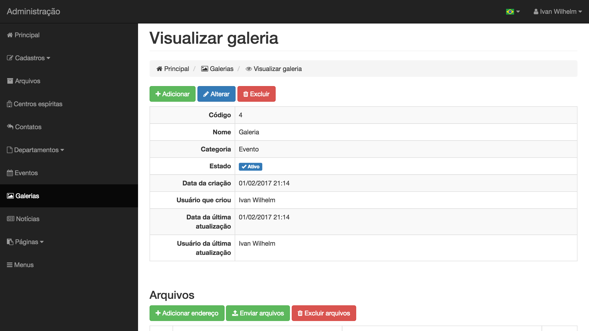

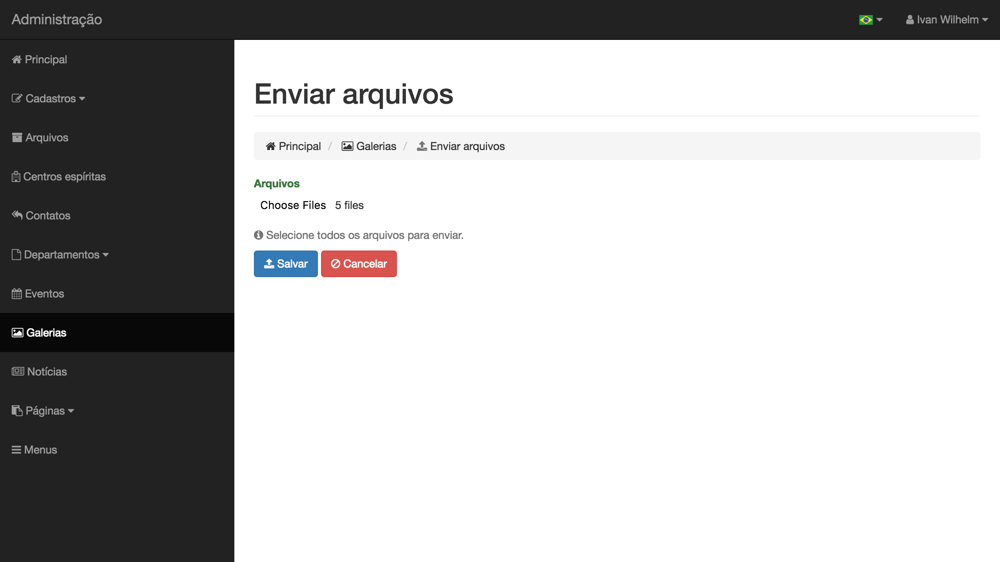

Download de arquivos

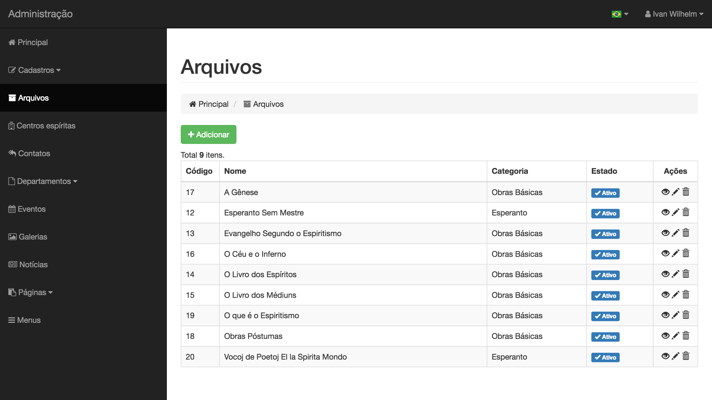

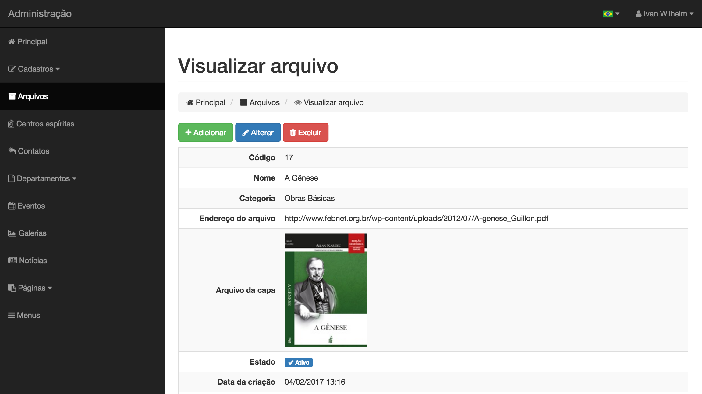

Eventos

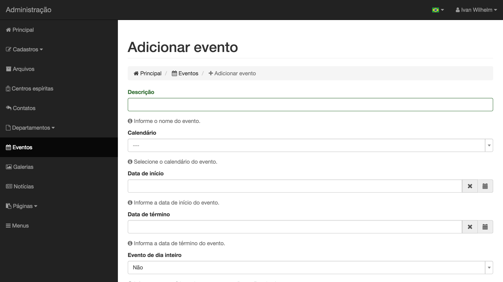

Usuários e senhas

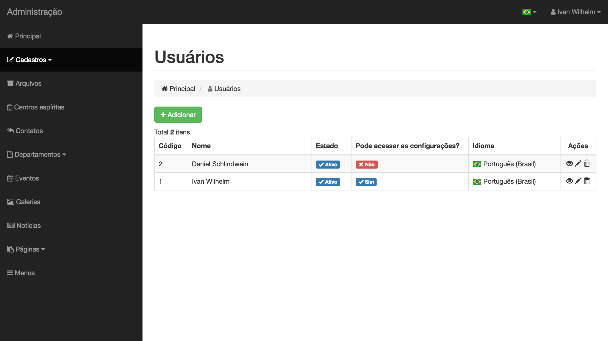

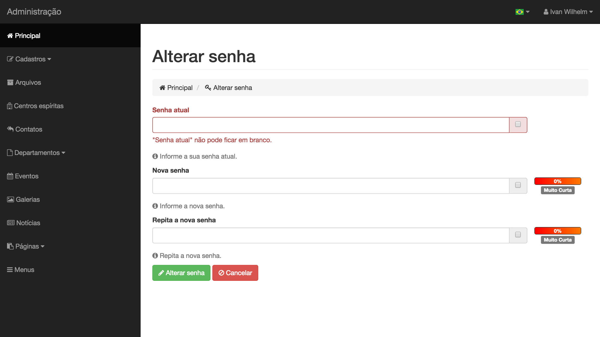